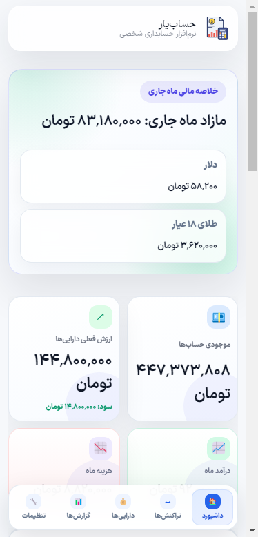

<div align="center">


# HesabYar — Android (حساب‌یار)

**Native Android app for HesabYar — the Persian personal-accounting suite.**

Pixel-identical to the mobile web experience, fully offline (local SQLite), and syncs both ways with your site — and, through it, with the [desktop app](https://github.com/hrschemiker/hesabyar-desktop).



</div>

---

> **Language note.** This README is in English; the app itself is **entirely in Persian (RTL)** — Toman/Rial, Jalali (Shamsi) calendar, Persian numerals.

## What it is

A real Android app (Kotlin, Gradle, APK — opens in Android Studio) whose UI is a full-screen **WebView** running the *exact* same HTML/CSS/JS and fonts as the mobile website, so it looks and behaves identically. All data is stored **locally on the phone** in SQLite (via `sql.js`, persisted through a native bridge) and works fully **offline**. When online, it syncs both ways with the companion WordPress plugin.

## Features

Everything the web/desktop app has, in your pocket: dashboard, accounts (multi-currency), 11 transaction types with the step-by-step mobile entry wizard, categories, debts, loans with installment schedules, cheques, recurring payments, receivables, assets with live valuation & goals, rich reports (incl. per-item spending and the financing-vs-expense split), rates, settings, archive (close a period + PDF), Jalali calendar and Persian numerals — same fonts (**IRANSansX** + **Gramophone**).

## Sync — phone ↔ site ↔ desktop

Data flows through your WordPress site (the hub):

1. In WordPress: install the [HesabYar plugin](https://github.com/hrschemiker/hesabyar-wordpress-plugin) (v3.13.0+), and enable **«اتصال نرم‌افزار دسکتاپ»** in its settings.
2. In the Android app: **تنظیمات → اتصال به سایت** → enter your site URL and WordPress username/password, then connect.
3. What you enter on the phone is pushed to the site; the desktop app auto-syncs with the site too — so phone → site → desktop (and back). Sync runs automatically on launch and when the connection returns.

## Download & install

Grab the APK from the [**Releases**](../../releases) page and install it on your phone (you may need to allow "install from unknown sources").

## Build from source

Requires Android Studio (or the Android SDK + JDK 17+).

```bash
# in Android Studio: File → Open → this folder → Run ▶
# or from the command line:
./gradlew assembleDebug      # -> app/build/outputs/apk/debug/app-debug.apk
```

> If your checkout path contains non-ASCII characters, keep `android.overridePathCheck=true` in `gradle.properties` (already set), or move the project to an ASCII path.

## How it works

- **Kotlin** `MainActivity` hosts a WebView served via `WebViewAssetLoader` (`app/src/main/assets/`), with a JavaScript bridge (`HesabYar`) for SQLite persistence and PDF export (Android print framework).
- The web layer reuses the desktop/plugin's rendering engine verbatim (`core.js`, `util.js`) plus a browser SQLite layer (`db-web.js` over `sql.js`) and the shared `hpa.css` / `hpa.js` — guaranteeing identical UI.
- Sync client (`sync.js`) talks to the plugin's REST API (`/wp-json/hpa/v1`).

## License

[MIT](LICENSE) © hrschemiker
